# 教室で使えるかもしれないもの作り #◯ 「学級新聞、いつ作るんですか」ハサミもノリもいらない学級新聞アプリ「デジタル・クラス新聞社」

## 🏫 はじめに

学級新聞を作ろう、と決めたところまではよかった。そのあとが大変だった。そんな覚えはありませんか。

原稿用紙を配って、集めて、薄い字を読み直して、画用紙に割り付けて、ハサミで切って、ノリで貼る。写真はプリンタで刷って、大きすぎたらもう一度刷り直す。子どもが書いた文章そのものは、とっくにできあがっているのです。それを一枚の紙にする作業だけで、放課後がいくつも消えていきます。しかも貼り終えたあとで「先生、ぼくのも載せてください」と言われると、もう戻れません。

このアプリが引き受けるのは、その「割り付けて、貼る」ところだけです。子どもはタブレットから記事を送ります。先生は届いた記事にチェックを入れて、順番を決めて、印刷を押します。それでA4一枚の学級新聞になります。

作ったものはこちらに置いてあります。

https://github.com/GIGAyama/Digital-Newspaper

ただし、URLを配ればすぐ使える、という形ではありません。学級の子どもの名前と写真をあずかるものなので、先生ご自身のGoogleアカウントの中に置いていただく形にしました。置き方は後半の導入手順に書いています。スプレッドシートを1つコピーして、公開の設定をするだけです。コードを貼り付ける作業はありません。手順は六つで、途中で待たされるところはありません。

案内ページは [digital-newspaper.giga-school.com](https://digital-newspaper.giga-school.com/) にあります。コピー用のリンクもそこに置いてあります。

## 📱 このアプリでできること

子どもが開く画面は、記入欄が五つ並んだ一枚きりです。漢字にはふりがなが付いています。

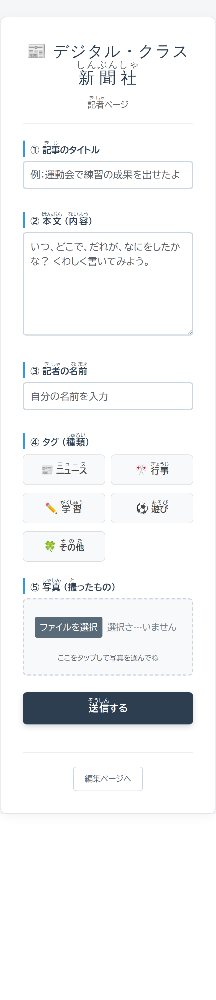

記者ページ。上から順に、タイトル、本文、名前、タグ、写真です。

タイトルと本文と名前を書いて、記事の種類をひとつ選んで、写真があれば選びます。写真はタブレットでその場で撮ったものも選べます。作文用紙の「いつ、どこで、だれが、なにをしたかな」という問いかけを、そのまま本文欄のうすい文字にしてあります。何を書けばいいか分からずに手が止まる子が、いちばん多いところだと思ったからです。

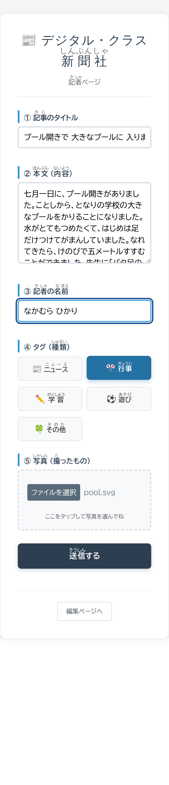

書けた状態。選んだタグの色が変わるので、押せたかどうかが目で分かります。

送信するを押すと、届いたことがはっきり出ます。ここを地味にしなかったのは、届いたのかどうか分からないまま何度も押してしまう子がいると思ったからです。

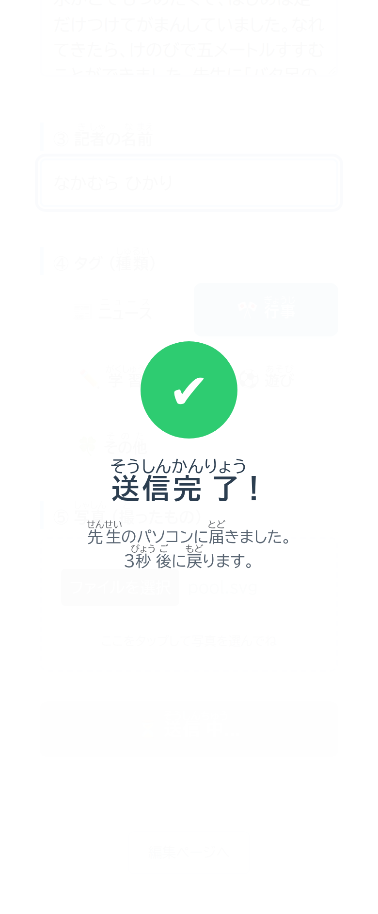

三秒たつと入力欄が空になり、続けて次の記事が書けます。

ここでいちばん心配だったのは、学級の全員が同じ時間に送信を押す場面です。授業の終わりに「では送ってください」と言えば、三十人が同時に押します。同じ場所に同時に書き込むとデータが壊れることがあるので、書き込みは一人ずつ順番に通るようにしてあります。順番待ちで届かなかった子には「混雑中」と出て、二秒、四秒、六秒と間をあけながら、三回まで自動でやり直します。子どもが押し直す必要はありません。押し直させると、同じ記事が二本届くほうが困るからです。

先生が開く画面は、上半分が操作パネル、下半分が実際に印刷される紙面です。紙面はいつでも今の設定がそのまま出ているので、押した結果がすぐ見えます。

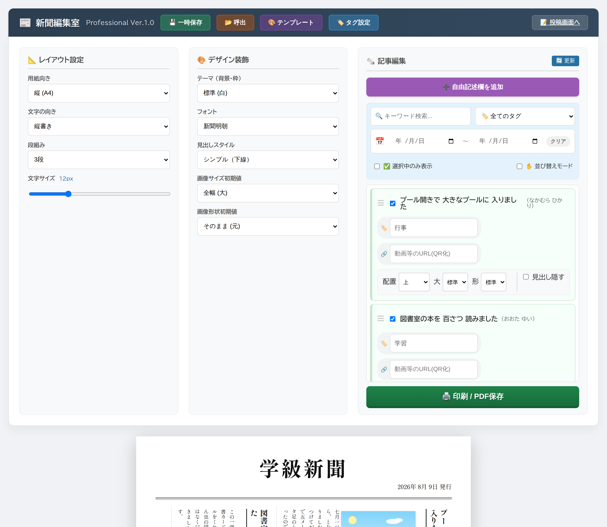

新聞編集室。左からレイアウト設定、デザイン装飾、記事編集と並びます。

右の記事一覧に、届いた記事が新しい順で並びます。チェックを入れた記事だけが紙面に載ります。開いた時点で上から三件に印が付いているので、まず何も触らずに紙面の形が見られます。

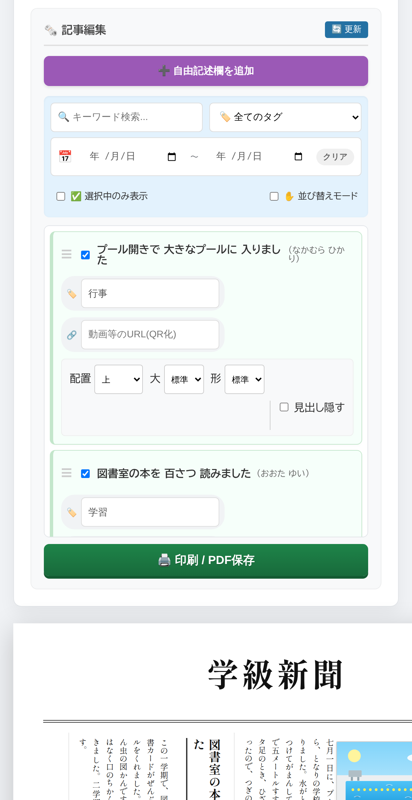

記事一覧。子どもが送った記事が、そのまま並んでいます。

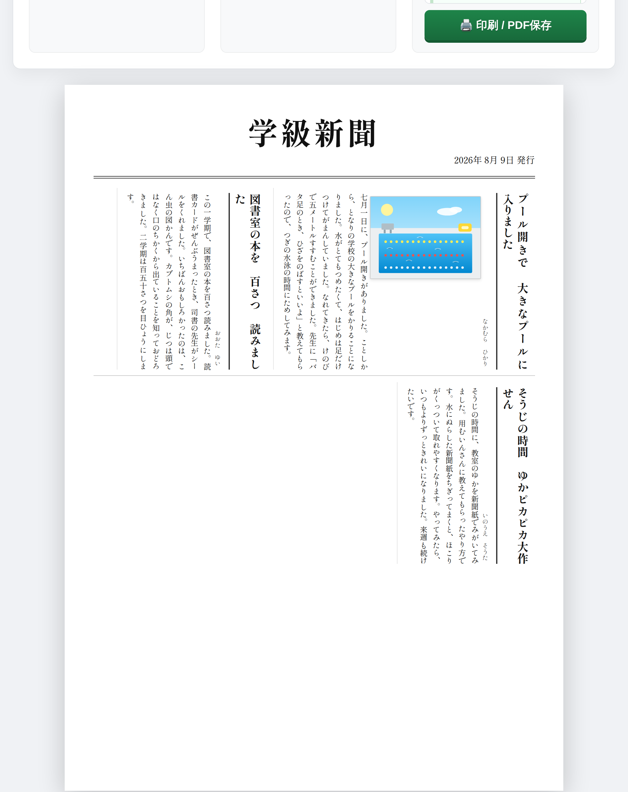

チェックを入れた三件が、そのまま縦書きの紙面になっています。

記事が増えてくると、目当てのものを探すのが大変になります。タイトルと記者名からの検索、タグでの絞り込み、投稿日での絞り込みが付いています。

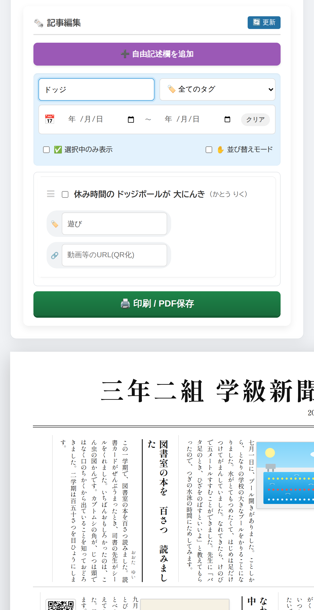

「ドッジ」と打つと、その語を含む記事だけが残ります。

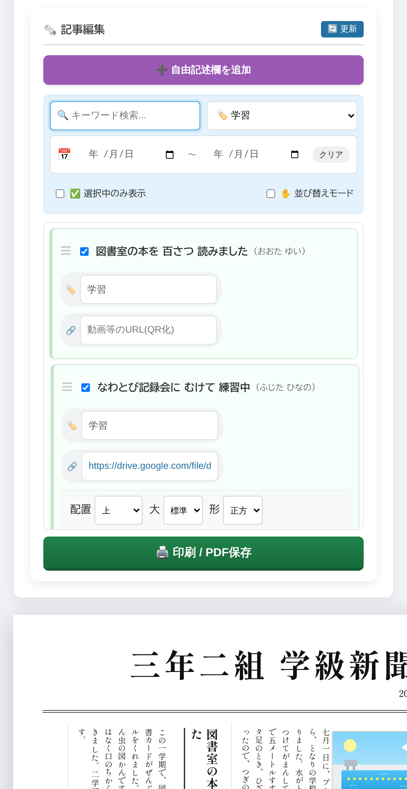

学習のタグが付いた記事だけを並べたところ。絞り込みで一覧から消えても、チェックは外れません。

## 🗞️ 縦書きの紙面が、その場で組み上がる

学級新聞らしさは、縦書きと段組みでほとんど決まると思っています。だからそこは最初から縦書き三段にしてあります。設定を何も触らないまま開いても、もう新聞の形になっている。そこから始めたかったからです。文書作成ソフトで学級新聞を作ろうとすると、縦書きに切りかえるところと段を分けるところで手が止まりがちです。最初からそうなっていれば、その手前でやめずに済みます。

紙面の文字は、その上でそのまま直せます。新聞名も、発行日も、記事の見出しも、記者名も、本文も、クリックして打ち直すだけです。子どもの原稿の書きまちがいを直すのに、元のデータを触りにいく必要はありません。

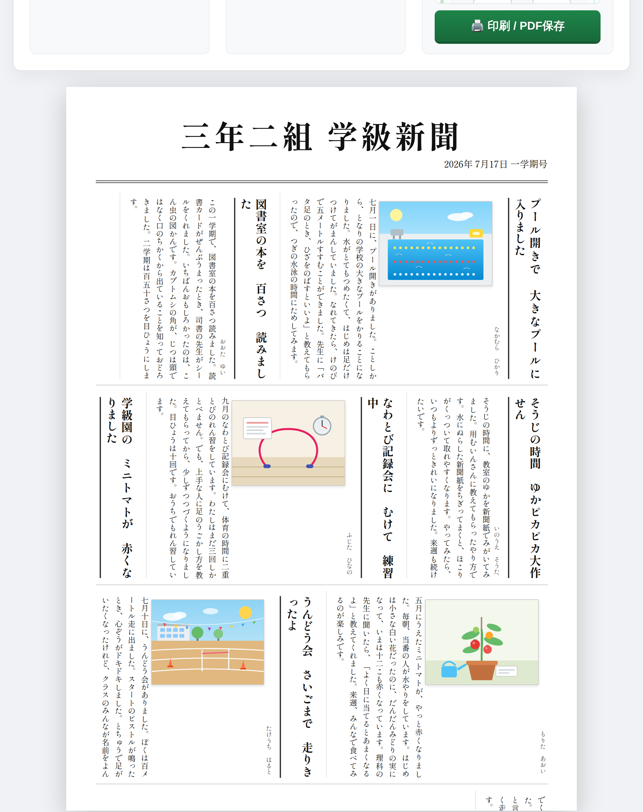

新聞名を「三年二組 学級新聞」に、発行日を「一学期号」に打ち直したところ。

写真は、記事ごとに置き方を変えられます。上に置くか、左右に回り込ませるか、下に置くか。大きさは三段階、形は正方形や横長など四種類から選べます。

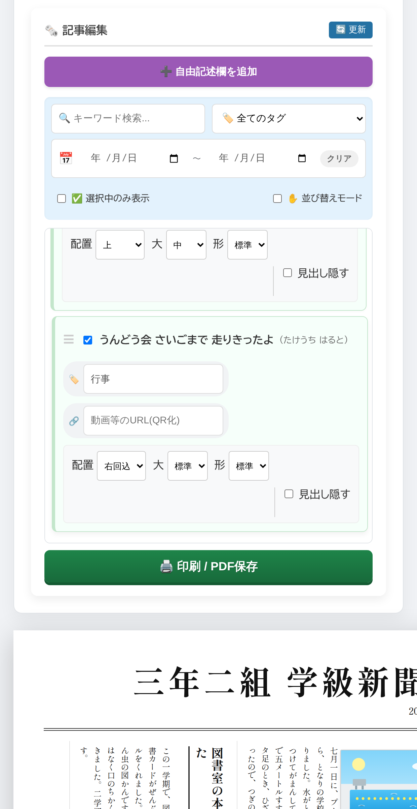

チェックが入っていて写真のある記事にだけ、配置と大きさと形の欄が出ます。

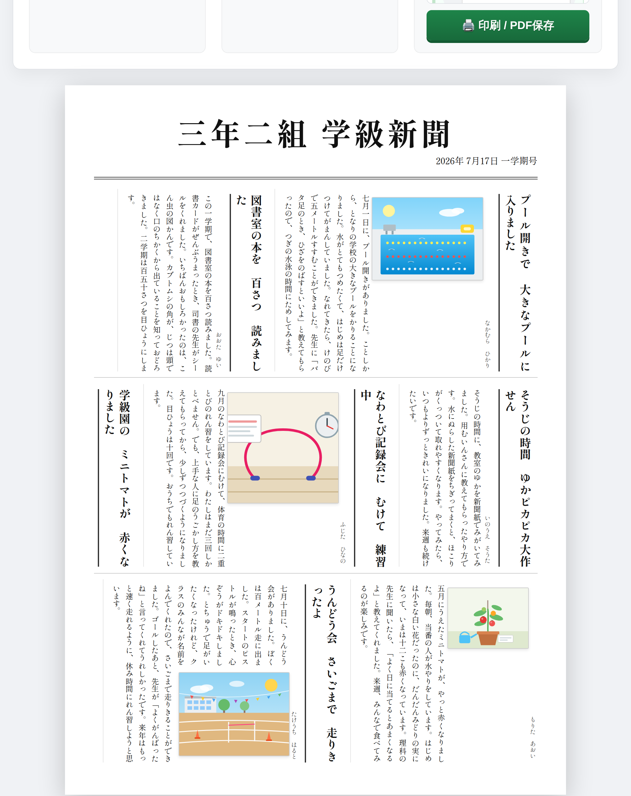

同じ記事でも、写真の置き方を変えるだけで紙面の印象が変わります。

用紙の向き、縦書きか横書きか、段の数、文字の大きさは、上のレイアウト設定でまとめて変えられます。段は一段から四段まで選べます。文字の大きさは、つまみで八から二十四まで細かく動かせます。

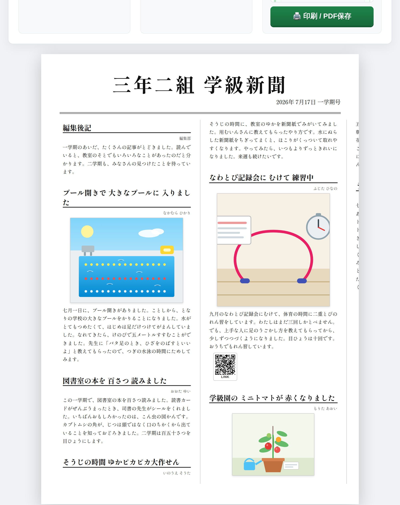

横書きの二段に変えたところ。低学年の学級だよりならこちらのほうが読みやすいと思います。

見た目のほうは、テーマが七種類、フォントが五種類、見出しの飾りが六種類あります。

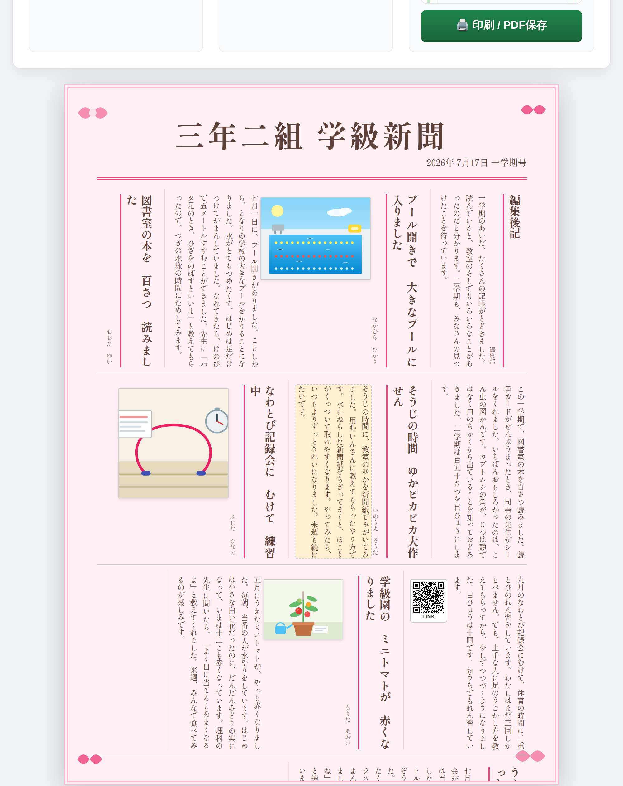

春のテーマ。四すみに桜が入ります。季節ごとに替えると、綴じたときに一年の流れが見えます。

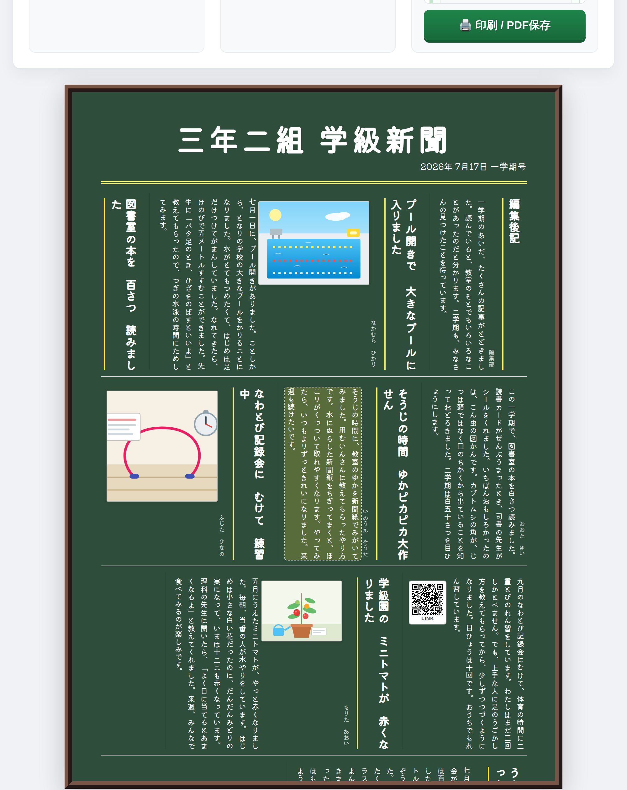

黒板のテーマに、手書き風のフォントを合わせたところ。教室に貼る一枚ならこれもありだと思います。

投稿によらない欄も足せます。編集後記や、先生からのひとことです。

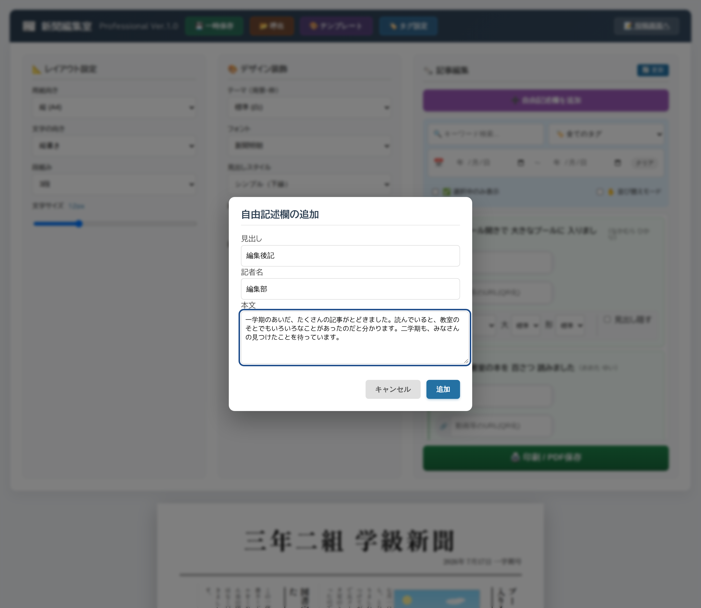

見出しと記者名と本文を打って追加すると、一覧の先頭に入ります。

右上に編集後記が入りました。子どもの記事と同じように、位置も文字も直せます。

ここまで全部、ブラウザの中だけで終わります。追加のソフトはいりません。

いっぽうで、あえて付けなかったものもあります。子どもが自分の記事をあとから直したり消したりする画面は作りませんでした。直せるようにすると、紙面を組んでいる最中に元の文章が変わることになります。先生が読んで選んだあとで中身が入れ替わるのは、いちばん困る壊れ方だと思ったからです。直しは先生が紙面の上で行う、という形に寄せました。

## 🔗 紙にのせられなかったものは、QRコードで

学級新聞でいちばんもったいないのは、動画が載せられないことだと思っていました。運動会のリレーも、音楽会の合唱も、なわとびのお手本も、紙の上では止まったままです。

そこで、記事ごとにURLをひとつ紐づけられるようにしました。入れておくと、紙面のその記事にQRコードが刷り込まれます。

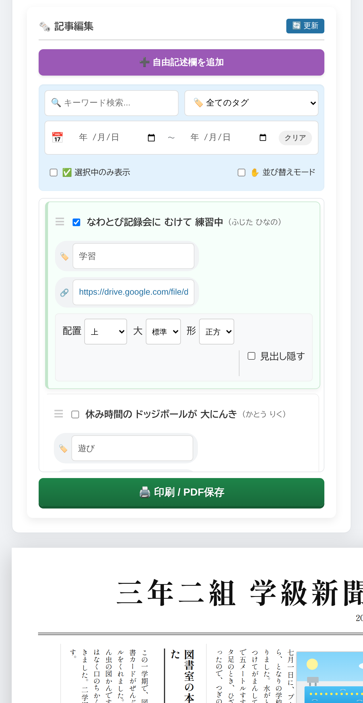

記事のリンクの欄に、動画のURLを貼るだけです。

なわとびの記事に、お手本動画へのQRコードが入りました。おうちの方が持ち帰った新聞から動画を見られます。

このQRコードは、学校のネットワークが外部をどれだけ塞いでいても出ます。ここは一度失敗しているところです。以前は外部のサービスからQRコードを作る部品を読み込んでいて、学校でそこが塞がれると、先生の画面には四角い枠が出ているのに中身が空、という状態になっていました。画面上は何も壊れて見えないので気づけません。そのまま印刷すると、読み取れない白い四角が紙に刷られます。実際に測ったら、塗られた画素が二千五百から〇になっていました。

いまはその部品をアプリの中に入れてあります。外から読み込む実行コードは〇バイトです。印刷したときに読み取れるかどうかも、実際に描いたQRコードを読み直して確かめてあります。

## ✨ 導入のメリット

三つのいいことが期待できます。

一つ目は、先生の放課後が返ってくることです。切って貼る時間がまるごといりません。チェックを入れて順番を決めて印刷するだけなので、記事さえ集まっていれば、紙面を組むのは休み時間のうちに終わると思います。「載せたい記事が増えた」と言われても、チェックをひとつ足すだけで割り付けが組み直されます。

二つ目は、書く子が増えることです。原稿用紙は、配られた人しか書けません。この形なら、書きたいと思った子がその場でタブレットから送れます。新聞係だけの仕事だったものが、学級の全員に開かれます。届いた記事は先生がチェックで選ぶので、全部載せなければいけないわけでもありません。

三つ目は、子どもが自分の文章が紙になるところを見られることです。送った記事が紙面のどこに、どんな大きさで載るのか、その場で画面に出ます。教室の前の大きな画面に編集室を映しておいて、届いた記事がその場で紙面に並んでいくところを見せる、という使い方もできると思います。書いたものが人に読まれる形になるという実感は、作文の授業ではなかなか作れないものです。自分の書いた見出しが縦書きで大きく出ているのを見た子が、次の号でもう一本書いてくれたらいいなと思って作りました。

## 🛠️ 【管理者向け】導入手順

情報担当の先生に聞かれることを、先にまとめて書いておきます。

置き場所はGoogleスプレッドシートです。記事の文字はスプレッドシートに、写真はGoogleドライブに入ります。学校のGoogle Workspaceの中で完結するので、記事も写真も、ほかの会社のサービスに渡ることはありません。

学校のネットワークで許可が必要なのは script.google.com です。ここが塞がれていると、そもそも画面が開きません。写真を紙面に出すには drive.google.com も通しておいてください。unpkg.com と fonts.googleapis.com も読んでいますが、こちらは字の形と余白が変わるだけで、塞がれても入力も送信も印刷もできます。実際に塞いだ状態で確かめてあります。外から読み込む実行コードは〇バイトです。

置き方は、スプレッドシートをコピーするだけです。

1. [導入案内ページ](https://digital-newspaper.giga-school.com/)の「スプレッドシートをコピーして始める」を押し、コピーを作成する
2. できたファイルを開き、上のメニューから拡張機能、Apps Scriptと開く
3. 右上のデプロイというボタンから、新しいデプロイ、ウェブアプリの順に選ぶ。ここが公開の設定です。次のユーザーとして実行は自分、アクセスできるユーザーは同一ドメインの全員
4. スプレッドシートを開き直すと、新聞システムというメニューが出る
5. 先生のメールアドレスを設定で、ご自分のアカウントを登録する
6. 先生用管理画面を開くを選ぶと、先生用と子ども用の二つのURLが出る。子どもに配るのは子ども用のほうだけ

コードはコピーしたファイルの中に入っているので、貼り付ける作業はありません。記事も写真もそのファイルとその隣のフォルダに入るので、どこにできたのかを探す必要もありません。写真をためるフォルダは、最初の写真が届いたときに自動で作られます。場所を決めたいときだけ、メニューの写真フォルダの設定で指定してください。

学校のポリシーで外部のファイルのコピーが禁じられている場合は、Code.gs と post.html と admin.html の三つを Apps Script に貼り付ける手順もあります。入るものは同じです。[README](https://github.com/GIGAyama/Digital-Newspaper#readme) に書いてあります。

先に確かめておいていただきたいことが三つあります。

一つ目は、**子どもに URL を配る前に、先生がメニューの「先生のメールアドレスを設定」を済ませておいていただきたい**ことです。登録が済むまで、編集室は誰も開けません。登録したアカウント以外は、URL を知っていても編集室に入れませんし、記事一覧を取り出す関数も呼べません。画面のリンクを隠しているのではなく、サーバー側の関数ひとつひとつで確かめています。子ども用の画面に編集室へのリンクが出るのも、先生のアカウントで開いたときだけです。

二つ目は、投稿された写真の置きどころです。まず**校内ドメインの中でリンクを知っている人だけが見られる**設定で保存します。Google Workspace ではないアカウント（個人の Gmail など）ではその設定ができないので、その場合は**非公開**まで閉じたうえで、登録済みの先生にだけ閲覧権を渡します。どちらになったかは実行ログに残ります。「リンクを知っている全員が閲覧可」にはしません。

三つ目は、承認の仕組みがないことです。送られた記事は、先生の一覧にすべて出ます。載せるか載せないかはチェックで決まります。書いたものが自動で公開されることはありませんが、「先生が見る前にどこかに出る」心配がないだけで、「不適切な記事が届かない」わけではありません。

なお、サーバー側の処理は「デプロイした先生」として動きます。子どもは、先生のスプレッドシートにもドライブにも、いっさいアクセス権が要りません。子どもから見えるのは投稿画面だけです。

### シートを点検する

コピーしたスプレッドシートは先生のものなので、列を足したり並べ替えたりしていただいて構いません。記事の読み書きは列の番号ではなく**見出しの名前**で行うので、並べ替えても動きます。メモ用の列を右に足していただいても、アプリはそこに何も書きません。

とはいえ、見出しの行を消してしまったり、シートごと消してしまったりは起こります。そのときに何も言わずに壊れるのがいちばん困るので、メニューに二つ足しました。「シートを点検する」は、どこがどう違うかを並べるだけで何も書き換えません。「シートを直す」は、直せるものだけを確認を取ってから直します。直すのは「無いシートを作る」「空のシートに見出しを書く」「見出しの書き方をそろえる」「足りない列を右端に足す」の四つだけで、**列を消したり動かしたりはしません**。

見出しの行ごと消えている場合は、直せるとは言いません。そこで見出しだけを書き戻すと、間違った列に正しいラベルが付いて、事故が見えなくなるからです。一行目に行を挿して見出しを戻してください、と伝えて止まります。

タグは学級に合わせて作りかえられます。絵文字と名前とふりがなの三つを入れる形です。

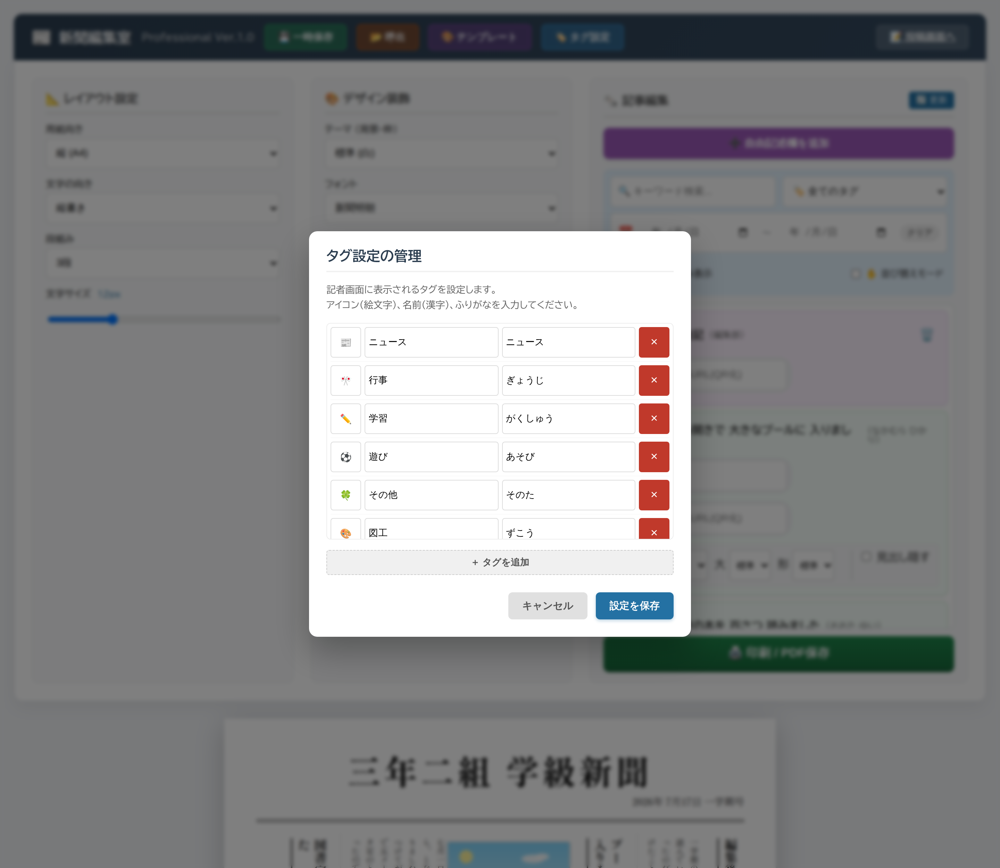

図工のタグを足しているところ。ふりがなの欄は、そのまま子どもの画面のルビになります。

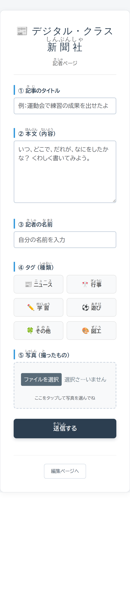

保存すると、次に子どもが開いたときから増えています。

共用の端末で使うときは、もうひとつ気をつけていただきたいことがあります。編集室で組んだ紙面は、保存を押すまでその端末のブラウザの中にしかありません。Chromebookは、開いたままのタブを裏で片づけてしまうことがあります。職員室に戻ってきたら編集途中の紙面が消えていた、ということが起こりうるので、席を立つ前に一時保存を押す癖をつけていただくのが安全です。

そのほか、知っておいていただくとよいことを並べます。紙面はA4一枚ぶんだけです。はみ出した記事は画面にも印刷にも出ないので、収まらないときは載せる記事を減らすか、文字を小さくするか、段を増やしてください。紙面の上で直した文章はスプレッドシートには戻りません。続きをやるなら一時保存が要ります。記事を消す機能はないので、消したいときはスプレッドシートの行を直接消します。オフラインでは動きません。動作は Google Chrome で確かめています。

読みやすさの点検もしてあります。文字と背景の明るさの差が基準に足りていない箇所が三十一件ありましたが、いまは〇件です。指で押す的が小さすぎた箇所も七十三件から〇件になっています。ふりがなが色のついたボタンの上で読めなくなっていた件は、いちばんふりがなが要る子がいちばん読めない形になっていたので、先に直しました。

## 📖 【利用者向け】使い方のガイド

### 子どもがやること

1. 配られたURLを開く
2. 記事のタイトルを書く
3. 本文を書く
4. 自分の名前を書く
5. 記事の種類をひとつ選ぶ
6. 写真があれば、写真の枠から選ぶ。なくてもかまわない
7. 送信するを押す

送信するを押すとボタンの文字が変わり、送っている最中だと分かります。

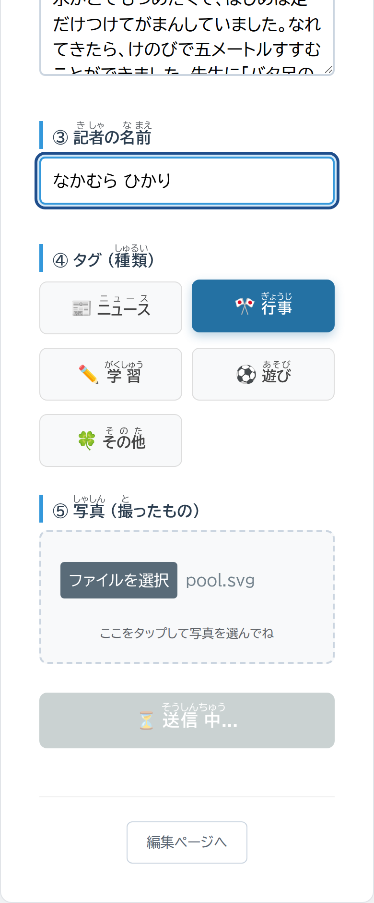

混み合っているときは「混雑中」と出ることがあります。そのまま待てば三回まで自動でやり直すので、押し直さなくて大丈夫です。

### 先生がやること

1. 編集室のURLを開く
2. 記事編集の一覧で、載せたい記事にチェックを入れる
3. 並べ替えモードをオンにして、記事の左のつまみをつかんで順番を入れかえる
4. 紙面の新聞名と発行日をクリックして打ち直す
5. 見出しや本文に直したいところがあれば、紙面の上でクリックして直す
6. 写真のある記事は、配置と大きさと形を選ぶ
7. 動画などにつなぎたい記事があれば、リンクの欄にURLを入れる
8. 用紙の向き、段の数、文字の大きさ、テーマを決める
9. 印刷のボタンを押す。紙に出さずに残したいときは、送信先でPDFに保存を選ぶ

印刷の画面では、背景のグラフィックを有効にしておいてください。テーマの飾りや黒板の背景は、ここが切れていると出ません。

### 途中でやめるとき

紙面の上で直した内容は、そのままではブラウザを閉じると消えます。続きをやるなら一時保存をしてください。

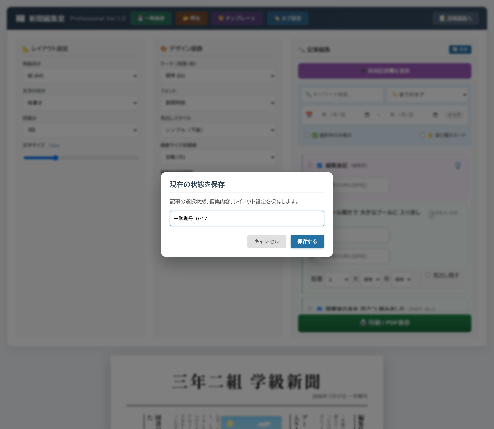

名前を付けて保存します。同じ名前でも上書きされずにたまっていくので、日付を入れておくと迷いません。

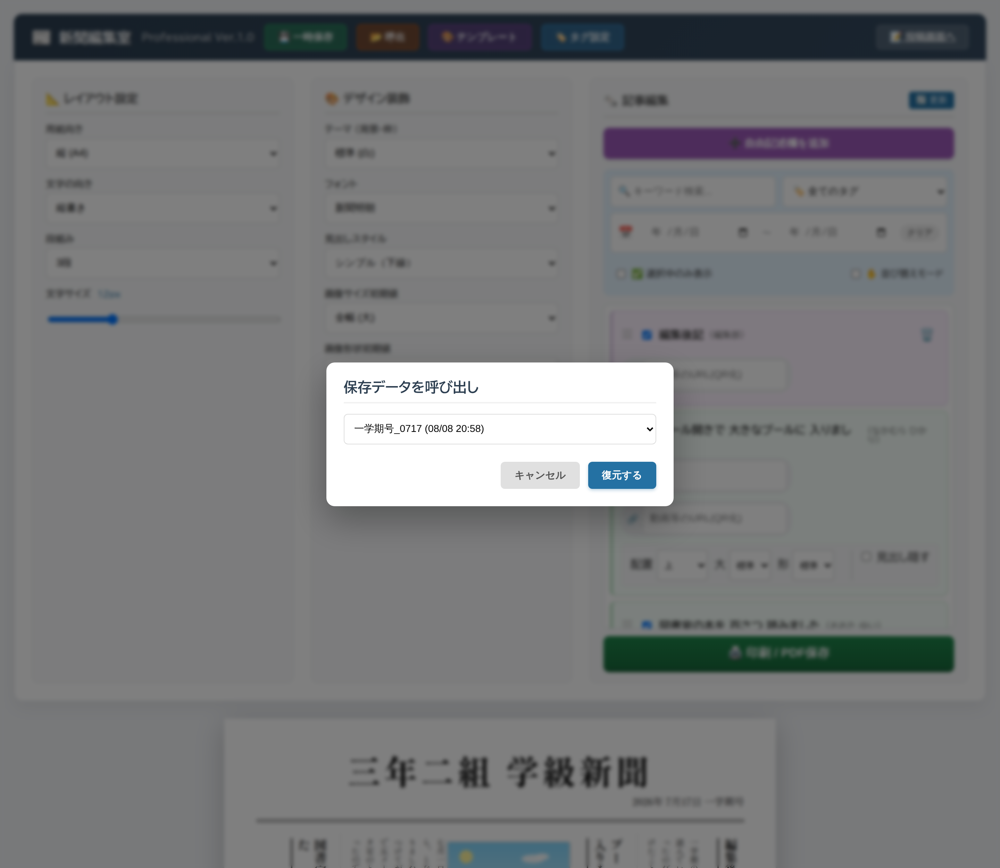

呼出から選ぶと、チェックの状態も、直した文章も、並べた順番も、紙面の設定も戻ります。

### 毎号そろえたいとき

見た目だけを取っておく機能もあります。用紙の向き、段の数、文字の大きさ、フォント、テーマなどをまとめて保存しておけるものです。

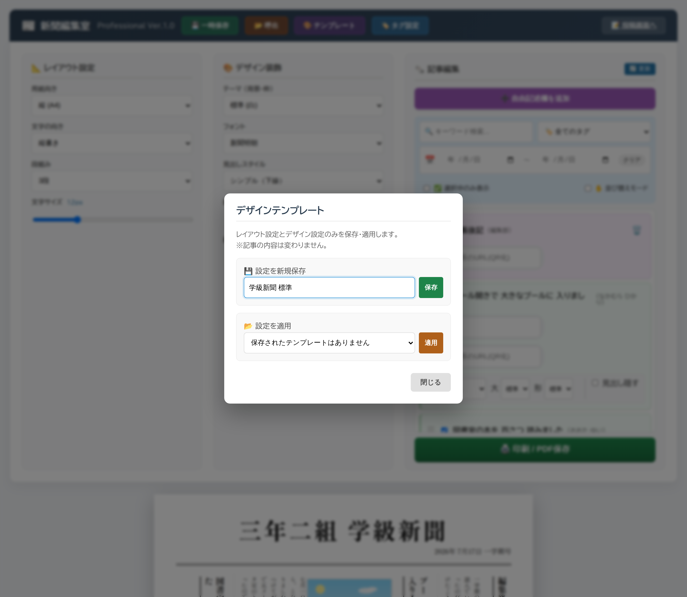

一号目で決めた体裁を保存しておくと、二号目からは選んで適用するだけになります。

保存や適用が終わると、右下に短い合図が出ます。

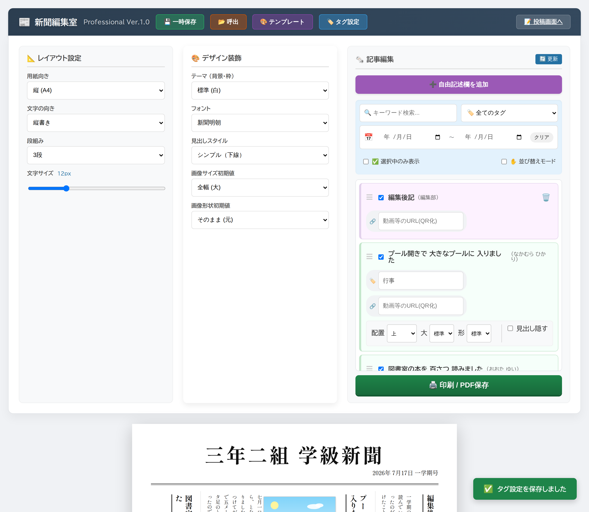

押した操作が効いたかどうかを、いちいち確かめにいかなくて済むようにしました。

## 📝 まとめ

学級新聞を作りたい理由は、たぶん「新聞を作ること」そのものではないと思います。書いたものが人に読まれるうれしさを知ってほしい、教室の外のことを見つけてくる目を育てたい、そういうところにあるはずです。

ところが実際にやってみると、時間のほとんどは切って貼ることに消えます。そして、いちばん時間がかかる作業は、いちばん子どもを育てない作業でもあります。そこを機械にわたして、空いた時間を、届いた記事を読んで一言返すほうに回せたらいい。そう思ってこれを作りました。

紙面を組む時間がなくなれば、そのぶん、一人ひとりの原稿に赤ペンを入れられます。子どもが送ってきた記事を読んで、「ここ、くわしく書けたね」と声をかけられます。ICTでできるのは、そこまでです。その先の、子どもと向き合う時間をどう使うかは、先生にしかできない仕事だと思っています。

はじめのうちは、一号ぜんぶをこのアプリで作らなくてもかまわないと思います。今月の一枚だけ、試しに組んでみる。うまくいかなければ、いつもどおり画用紙に戻ればいいだけです。うまくいったら、次の号から子どもにURLを配ってみる。それくらいの入り方がちょうどいいと思っています。

その一枚が出たあとに残るのは、切って貼らずに済んだ放課後と、自分の書いたものが紙になったところを見た子どもの顔だと思います。

一歩踏み出そうとする先生を、私はいつでも全力で応援しています。
