# 教室で使えるかもしれないもの作り #◯ 「学級新聞、いつ作るんですか」ハサミもノリもいらない学級新聞アプリ「デジタル・クラス新聞社」

## 🏫 はじめに

学級新聞を作ろう、と決めたところまではよかった。そのあとが大変だった。そんな覚えはありませんか。

原稿用紙を配って、集めて、薄い字を読み直して、画用紙に割り付けて、ハサミで切って、ノリで貼る。写真はプリンタで刷って、大きすぎたらもう一度刷り直す。子どもが書いた文章そのものは、とっくにできあがっているのです。それを一枚の紙にする作業だけで、放課後がいくつも消えていきます。しかも貼り終えたあとで「先生、ぼくのも載せてください」と言われると、もう戻れません。

このアプリが引き受けるのは、その「割り付けて、貼る」ところだけです。子どもはタブレットで記事を書き、あいことばひとつでとなりの端末に送ります。受け取った端末でチェックを入れて、順番を決めて、印刷を押します。それでA4一枚の学級新聞になります。

作ったものはこちらに置いてあります。

https://github.com/GIGAyama/Digital-Newspaper

以前の版は、先生のGoogleアカウントの中にスプレッドシートを置いて動かす形でした。今は作りを変えて、ブラウザを開くだけで使えるようにしてあります。アカウントも、コピーするファイルも、公開の設定もありません。書いたものはその端末の中にだけ残り、開発者のところにも、どこかのサーバーにも届きません。

もうひとつ変えたところがあります。以前は「子どもが送る画面」と「先生が組む画面」が分かれていて、組むほうには先生しか入れませんでした。今はその区別をなくしました。ひとつの画面の上のタブで、記事を書く側と新聞を組む側を行き来します。新聞係の子どもが、はじめから終わりまで自分で作れます。

案内ページは [digital-newspaper.giga-school.com](https://digital-newspaper.giga-school.com/) です。ここを開けばもう使えます。

## 📱 このアプリでできること

画面はふたつだけです。上のタブで行き来します。

「記事を かく」を押すと、書く側の画面になります。上から順に、タイトル、本文、記者の名前、タグ、写真の五つです。漢字にはふりがながふってあるので、低学年でも読めます。

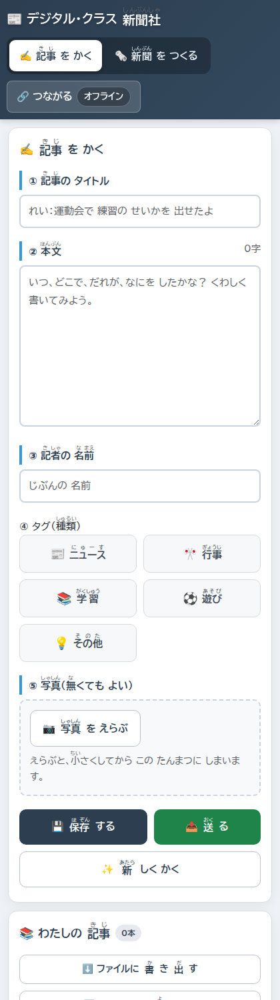

タブレットの縦画面でも、五つの欄がそのまま縦に並びます。横スクロールは出ません。

本文の右上には字数が出ます。改行を除いた数なので、「四百字書こう」といった目標とそのまま比べられます。

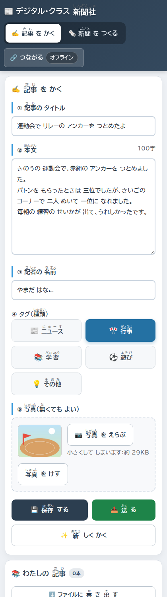

タグを選ぶと色が変わるので、押せたかどうかが目で分かります。写真は選んだ時点で端末の中で小さくなり、その大きさが下に出ます。

写真のことだけ、少し書いておきます。以前の版はGoogleドライブに置いていましたが、今はどこにも送りません。その代わり、選んだ瞬間に端末の中で長辺千二百ピクセルまで縮めます。教室でふつうに撮った写真なら、百五十キロバイトから三百キロバイトほどです。縮めるのはブラウザの中だけで完結する処理なので、外に出ていく通信は起きません。

置き場所も分けてあります。記事の文字はブラウザのローカルストレージに、写真はIndexedDBという別の入れものに入れています。ローカルストレージは五メガバイトしかなく、写真をそこに入れると四十本ほどで一杯になります。IndexedDBは端末の空きに応じた大きさまで入るので、試した端末では九百二十五メガバイトありました。写真つきの記事を学級全員ぶん集めても、ふつうは足りなくなりません。

では、なぜ全部をIndexedDBにしないのか。IndexedDBへの書き込みは非同期で、端末がメモリ不足でタブを捨てるときに、最後まで書き終わる保証がありません。記事の文字はローカルストレージに同期で書いて、確実に残します。写真は撮り直せますが、書いた文章は撮り直せないからです。

書いた記事は右側にたまっていきます。

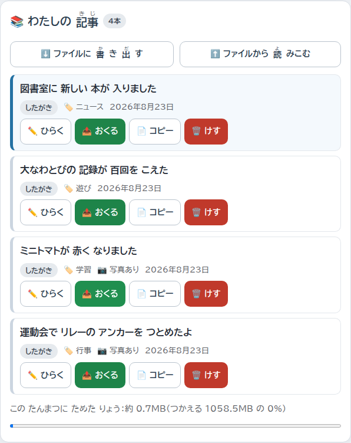

一本ごとに「したがき」「おくった」「のせてもらった」のどれかが付きます。自分の記事がいまどこにいるのかが、聞かなくても分かります。

一覧からは、開いて直す、複製する、消す、送る、ができます。複製は「同じ書き出しでもう一本書きたい」ときに使います。元の記事はそのまま残ります。

いちばん下には、その端末にどれだけたまっているかと、使える量が出ます。八割を超えると赤くなります。黙って上限に当たると「送ったのに保存されていない」が起きるので、先に見えるようにしてあります。

## 🔗 あいことばだけで、記事が集まる

学級のみんなの記事を一台に集めるところが、このアプリのいちばん変わったところだと思います。

名簿を作る必要がありません。アカウントも要りません。ログインもありません。集める側が「へやを ひらく」を押すと、十文字のあいことばが出ます。

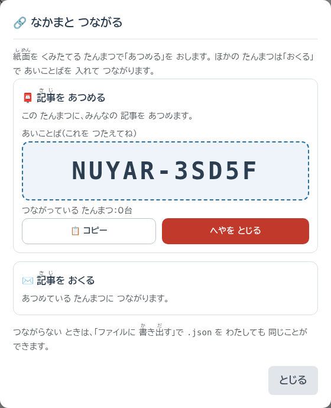

この十文字を板書するか、読み上げるだけです。つながっている台数もここに出ます。

見まちがえやすい 0 と O、1 と I と L は使っていません。板書を写しまちがえて入れない、という事故がいちばん多いと思ったからです。

送る側は、そのあいことばを入れて「はいる」を押します。

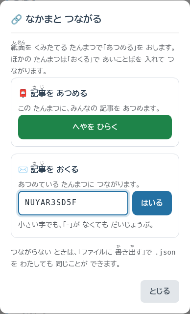

小文字で打っても、区切りの記号を入れなくても通ります。子どもの入力を、大人の書き方に合わせさせないためです。

つながったら、記事の「おくる」を押します。

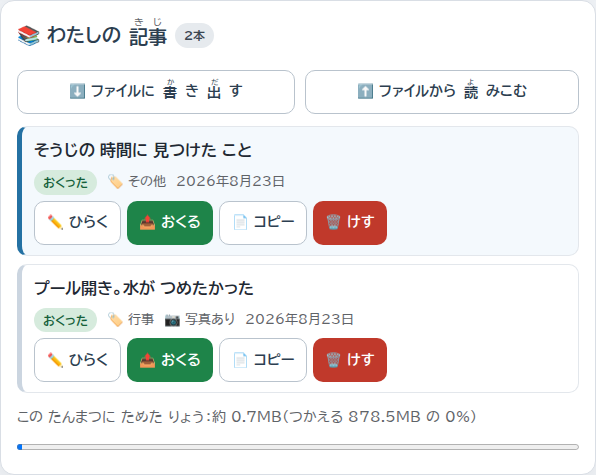

届いた合図が返ってきてはじめて「おくった」に変わります。押した瞬間に変わるのではありません。届いていないのに届いた顔をされるのがいちばん困るからです。

集める側には、こう並びます。

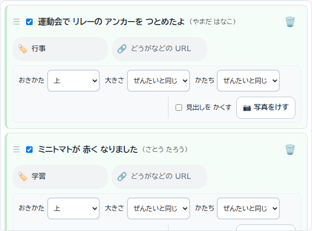

届いた記事は左のふちが青くなります。そして、チェックは入っていません。載せるものは集めた人が選びます。

自分で書いた記事は、はじめからチェックが入っています。ひとりで作るときに、書いてタブを切りかえたら紙面に出ている、という流れにしたかったからです。

チェックを入れると、書いた子の画面が変わります。

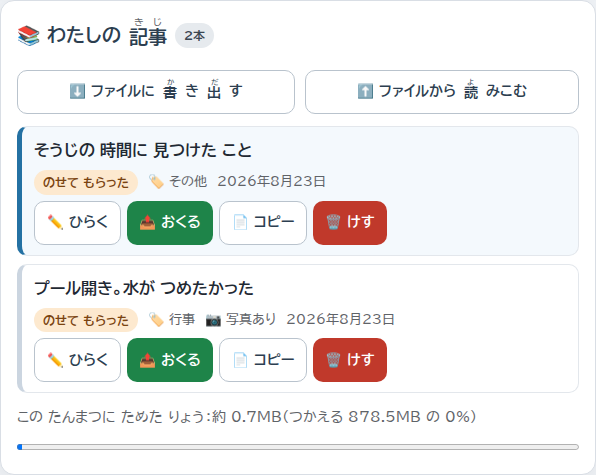

「のせてもらった」に変わります。掲示するまで待たなくても、自分の記事が採られたことがその場で分かります。

つながっていないあいだに書いた記事は、次につないだ瞬間にまとめて送られます。教室のネットワークが不安定でも、書いたものが宙に浮きません。

ひとつ、正直に書いておかなければならないことがあります。あいことばは宛先であって、合いかぎではありません。板書を写真に撮られれば、その十文字を知っている人はだれでもそのへやに入れて、記事を送りこめます。八十二兆通りあるので総当たりで当てられることはありませんが、それとこれとは別の話です。授業が終わったら「へやを とじる」を押してください。次に開いたときは別のあいことばになります。

学校のネットワークがこの種の通信を塞いでいることもあります。その場合は、記事をファイルに書き出して渡す道が用意してあります。通信をまったく使わずに、同じことができます。

## 🗞️ 縦書きの紙面が、その場で組み上がる

「新聞を つくる」に切りかえると、こうなります。

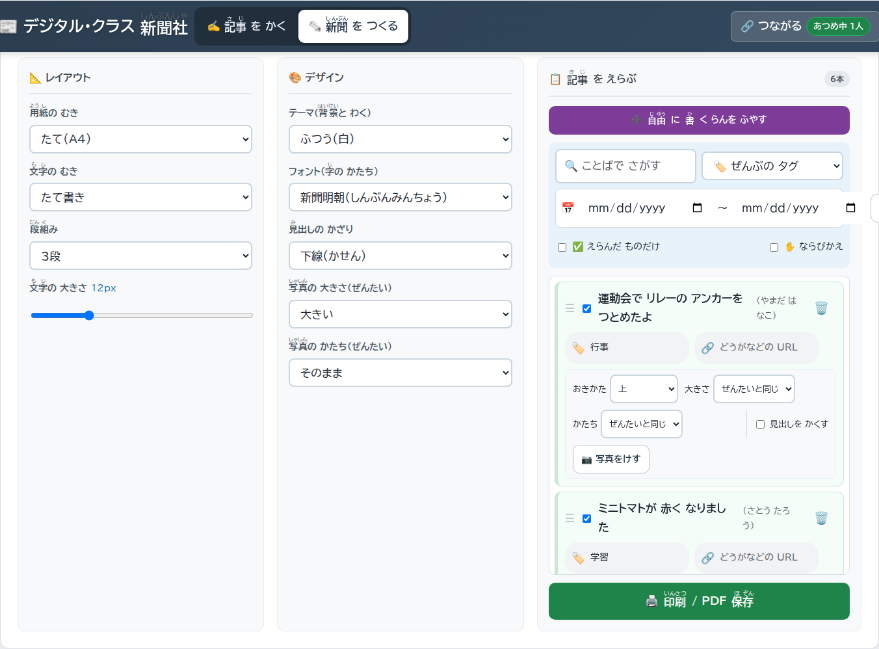

左からレイアウト、デザイン、記事を選ぶところ、と並びます。押したものはすぐ下の紙面に出ます。

下がその紙面です。

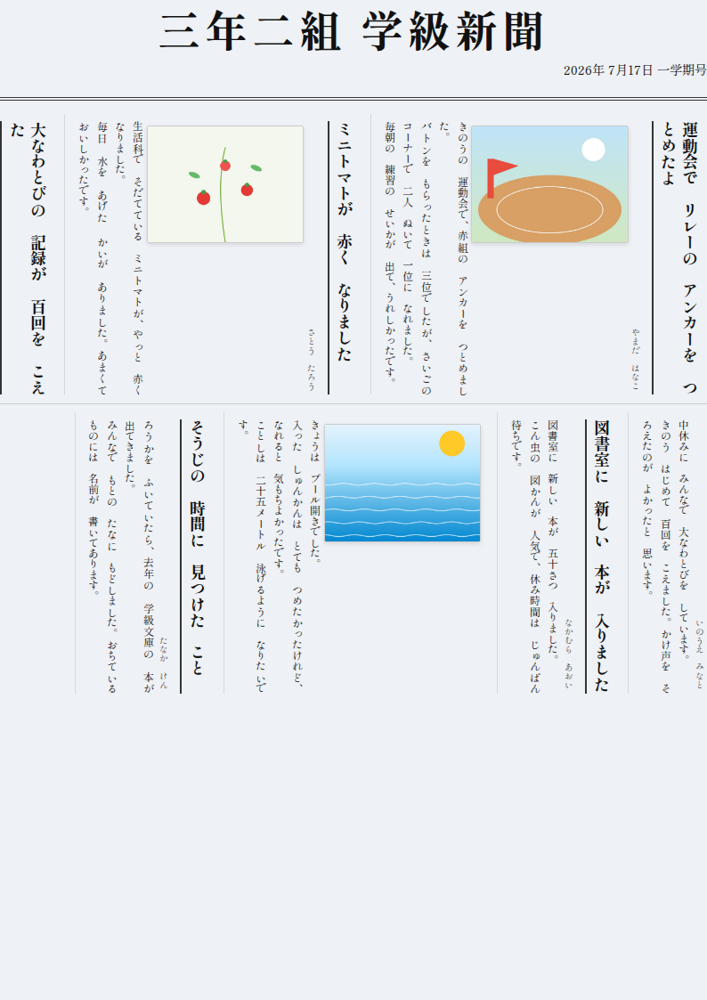

チェックを入れた記事が、そのまま縦書きの新聞になっています。段の中で行が折り返し、次の記事が続きます。この割り付けを手でやっていた、と思うと不思議な気持ちになります。

新聞名と発行日は、紙面の上でそのまま打ちかえられます。見出しも、記者名も、本文も同じです。子どもの書いた文章に手を入れたいときは、ここで直します。元の記事は変わらないので、直したのがどちらだったか分からなくなることはありません。

写真は記事ごとに置き方を変えられます。

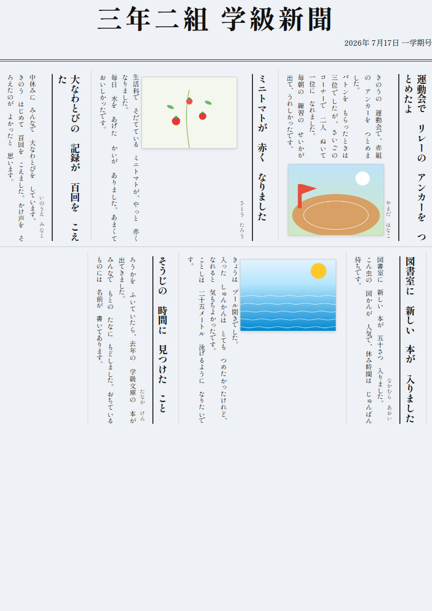

同じ記事でも、写真を右に回りこませるだけで紙面の印象が変わります。

紙に載せきれなかったものは、QRコードにできます。

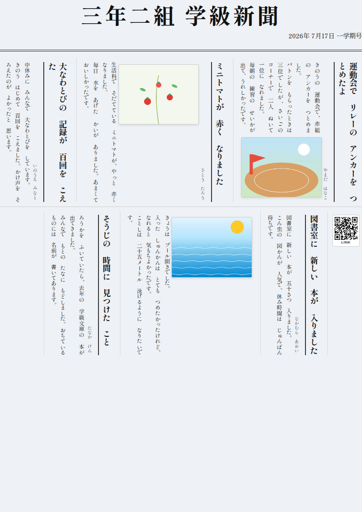

記事のリンクの欄に動画のURLを貼ると、紙面に刷り込まれます。持ち帰った新聞から、おうちの方が動画を見られます。

このQRには少しだけこだわりがあります。画面で見えているのは五十ピクセル四方ですが、実際には倍の画素で描いています。先生のパソコンが高精細でなくても、刷ったときに読み取れる濃さになるようにするためです。以前の版では、学校のネットワークがQRを作る部品を塞いだために、読み取れない白い四角がそのまま刷られたことがありました。今は部品をアプリの中に持っているので、塞がれても同じように出ます。

テーマは七つあります。

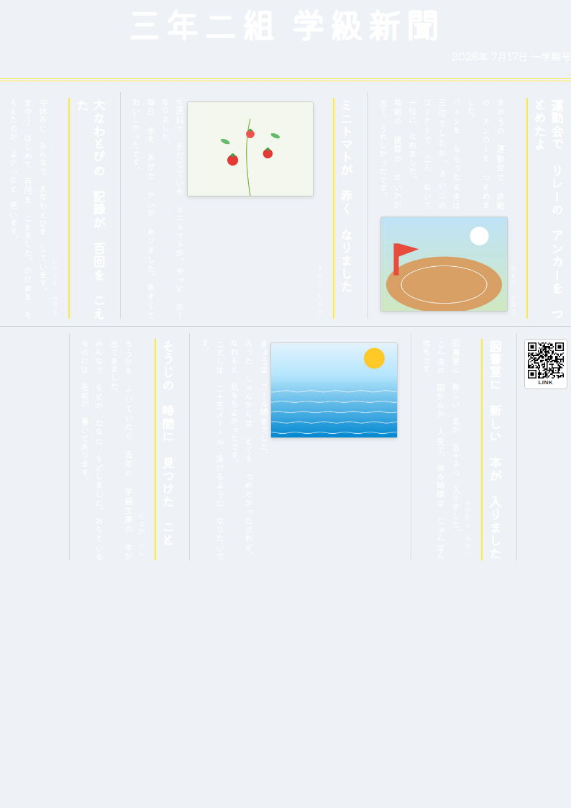

黒板のテーマに手書き風のフォントを合わせたところです。教室に貼る一枚ならこれもありだと思います。

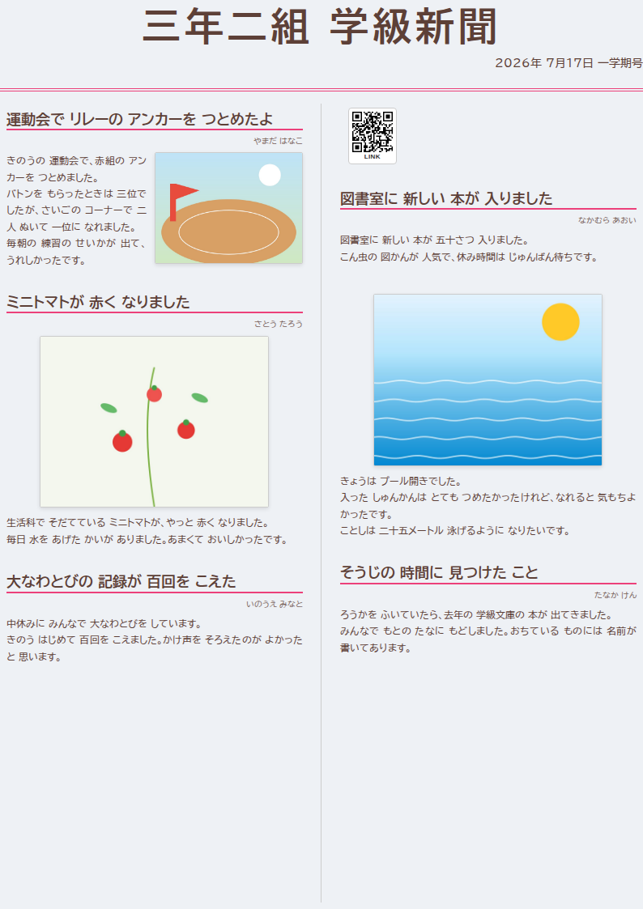

春のテーマで、横書きの二段にしたところ。低学年の学級だよりならこちらのほうが読みやすいと思います。

投稿によらない欄も足せます。

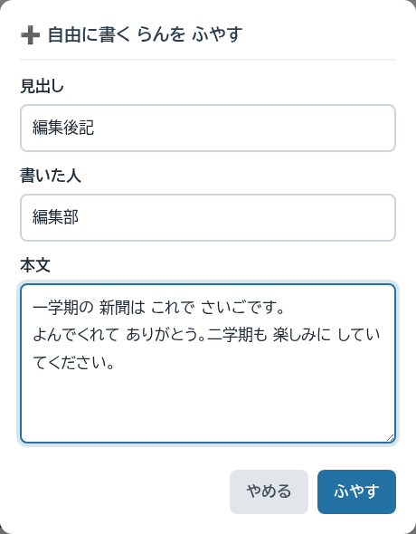

見出しと書いた人と本文を打って追加すると、一覧の先頭に入ります。

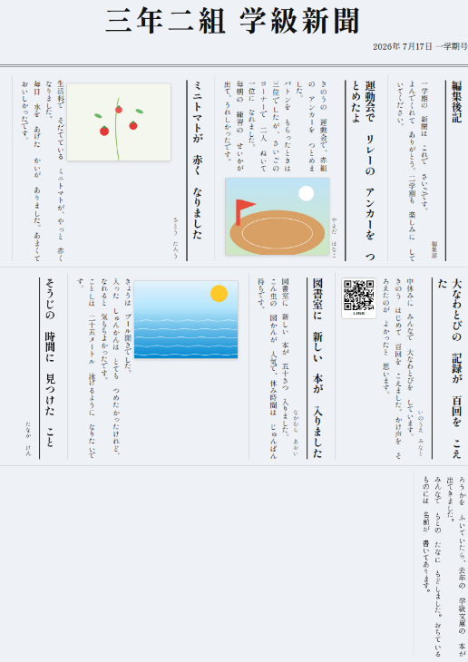

右上に編集後記が入りました。子どもの記事と同じように、位置も文字も直せます。

段は一段から四段、文字の大きさは八から二十四まで動きます。用紙は縦と横、文字は縦書きと横書き、フォントは五種類、見出しの飾りは六種類です。決めた体裁はテンプレートとして名前を付けて残せるので、二号目からは選んで当てはめるだけになります。

紙面はA4一枚ぶんです。はみ出した記事は画面にも印刷にも出ません。ここは割り切りました。二枚目に続くようにすると、どこで切れるかを気にしながら文章を書くことになり、子どもの書く手が止まると思ったからです。

## ✨ 導入のメリット

放課後が返ってきます。切って貼っていた時間が、そのまま消えます。

書いた子が、自分の記事の行方を知ることができます。「したがき」から「おくった」へ、そして「のせてもらった」へ。掲示板の前で自分の名前をさがす前に、手もとで分かります。

先生が持ち帰るものが減ります。記事も写真も子どもの端末の中にあり、集めた端末の中にあります。USBメモリも、印刷した原稿の束もありません。

そして、子どもだけで作れます。画面に区別がないので、新聞係が自分であいことばを出して、自分で集めて、自分で組んで、印刷まで持っていけます。先生は印刷の前に一度見る、でよくなります。

ネットワークが落ちていても書けます。一度開いておけば、次からは通信がなくても起動して、書いて、組んで、印刷までできます。通信が要るのは、記事を送りあうときだけです。

## 🛠️ 【管理者向け】導入手順

手順はありません。ブラウザで開くだけです。

[digital-newspaper.giga-school.com](https://digital-newspaper.giga-school.com/)

配布用のファイルも、アカウントの用意も、公開の設定も要りません。それでも、学級で使う前に確かめておくとよいことが三つあります。

1. 一度みんなで開いておきます。二回目からは通信がなくても起動しますが、一回目だけは要ります
2. 端末どうしがつながるかを、二台で試します。一台で「へやを ひらく」、もう一台であいことばを入れる、それだけです。学校のネットワークがこの種の通信を塞いでいると、ここでつながりません
3. つながらなかった場合にそなえて、ファイルの受けわたしを試しておきます。「ファイルに 書き出す」で保存したものを、別の端末の「ファイルから 読みこむ」で開きます

三つめまで通れば、通信が使えない日でも同じことができます。

タグは五つ用意してあります。ニュース、行事、学習、遊び、その他です。図工や係活動を足したいときは「タグ設定」で変えられます。集めている側で保存すると、つながっている端末にも同じタグが届くので、学級でそろえるのがひと手間で済みます。

端末に入れておくこともできます。画面右上の「追加」を押すと、ホーム画面のアイコンから開けるようになります。iPadのSafariだけは「インストールできます」の合図を出さない仕様なので、「追加」を押すと共有ボタンからの手順が画面に出ます。

## 📖 【利用者向け】使い方のガイド

### 記事を書く

1. 「記事を かく」を押します
2. タイトル、本文、名前を入れ、タグをひとつ選びます
3. 写真があれば選びます。なくてもかまいません
4. 「保存する」を押します

名前は次に書くときも引き継がれます。毎回打ち直す必要はありません。

### 記事を集める

1. 紙面を組む端末で「つながる」を押し、「へやを ひらく」を押します
2. 出てきた十文字を伝えます
3. ほかの端末は「つながる」からその十文字を入れて「はいる」を押します
4. 記事の「おくる」を押します

使い終わったら「へやを とじる」を押してください。

### 新聞を組んで印刷する

1. 「新聞を つくる」を押します
2. 載せる記事にチェックを入れます
3. 用紙の向き、段組み、テーマを決めます
4. 紙面の上で新聞名と発行日を打ちかえます
5. 「印刷 / PDF保存」を押します

印刷の画面では、余白を「なし」に、背景のグラフィックにチェックを入れてください。テーマの色はここで出ます。

### 途中でやめるとき

紙面の状態は自動で保存されますが、名前を付けて残すこともできます。「一時保存」で名前を付け、次に開いたときに「呼び出し」から戻します。選んだ記事も、直した文章も、並べた順番も、新聞名も戻ります。

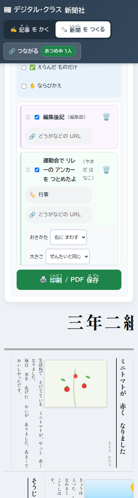

三百九十ピクセル幅でも、操作パネルは縦に積まれて全部に手が届きます。組む作業も、その気になれば手もとの端末でできます。

### 気をつけること

記事はその端末のブラウザの中にだけあります。別の端末で開いても出てきません。ブラウザの履歴やサイトデータを消すと、いっしょに消えます。残しておきたいものは、印刷するか、ファイルに書き出してください。

消した記事は戻せません。ここは確認を出すだけにしてあります。

## 📝 まとめ

このアプリは、学級新聞づくりのうち「割り付けて、貼る」ところだけを引き受けます。書くことも、何を載せるか決めることも、子どもと先生の仕事のまま残ります。そこは減らすところではないと思っています。

以前の版から変えたのは、サーバーをなくしたことと、先生と子どもの区別をなくしたことの二つです。どちらも「先生が先に準備しないと始まらない」を消すための変更でした。準備が要るものは、忙しい週には使われません。開いたらもう使える、というところまで持っていきたかったのです。

教室で使ってみて、こうだったらもっといい、というところがあれば教えてください。作った本人が気づけるのは、たいてい半分くらいです。
